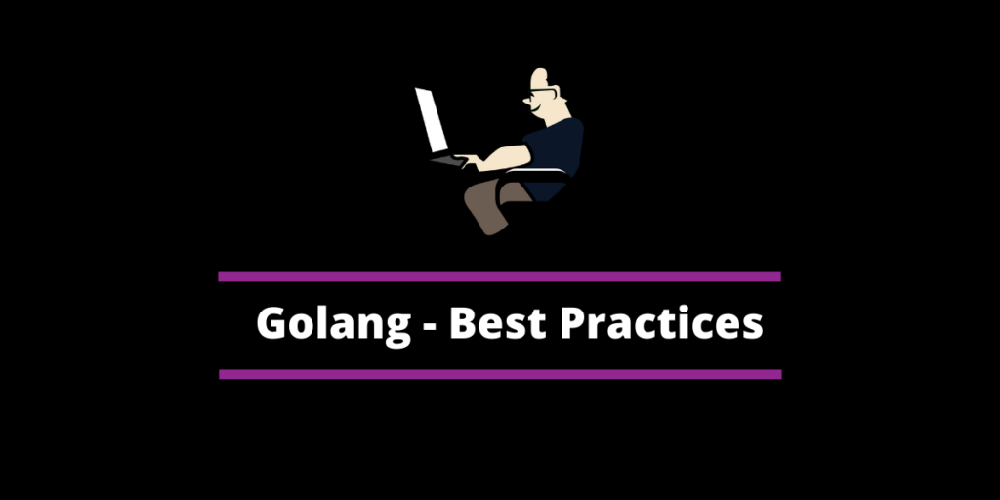

# Golang Best Practices
### A collection of Golang best practices and Important note

* [Software Engineering](software.md)
* [golang](golang.md)
* [log](log.md)
* [module](module.md)
* [pprof](pprof.md)
* [build](build.md)